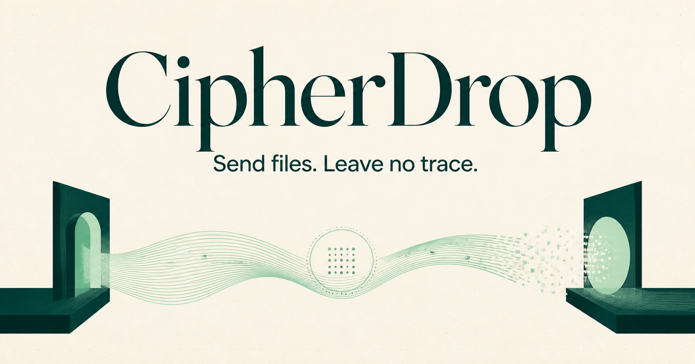

# CipherDrop

Secure, temporary, end-to-end encrypted file sharing directly between two browsers. Create a one-time room, share its code or private invitation link, approve the connection, and transfer a file without creating an account.

**Live application:** [cipherdrop-nu.vercel.app](https://cipherdrop-nu.vercel.app/)



## Why CipherDrop?

Most file-sharing services require an account, upload files to permanent storage, or encourage sharing through social platforms. CipherDrop provides a focused alternative for short-lived, person-to-person transfers:

- No sign-up or login
- Unique room codes and private invitation links
- Explicit connection and file acceptance
- End-to-end encryption in the browser
- Direct peer-to-peer transfer whenever the network allows it
- No permanent file storage on the CipherDrop server
- Automatic one-hour session expiry and manual session destruction
- Responsive interface for desktop and mobile browsers

## How it works

1. The sender opens CipherDrop and receives a temporary connection code and invitation link.
2. The receiver enters the code or opens the link.
3. The sender reviews and accepts the connection request.
4. Both browsers establish an encrypted WebRTC data channel.
5. The sender selects a file and the receiver approves it before downloading.
6. Closing or ending the session destroys the active connection; expired signaling data is removed automatically.

```text
Browser A ── temporary signaling ──> Render Node API + Upstash Redis
    │                                      │
    └──── encrypted WebRTC data channel ───┘ Browser B
             (file bytes travel here)
```

The Node.js API on Render coordinates room creation and WebRTC negotiation. It does not receive or store the transferred file contents.

## Security design

- Ephemeral ECDH P-256 key pairs for every connection
- HKDF-SHA-256 directional key derivation
- AES-256-GCM authenticated encryption for control messages and file chunks
- HMAC-SHA-256 authenticated invitation handshake
- Independent send and receive keys with sequence-based nonces
- Replay detection for encrypted packets
- SHA-256 file integrity verification before download completion
- Random bearer tokens for host and guest signaling authorization
- Strict frontend-origin allowlisting, security headers, and anonymous rate limiting
- Optional TURN relay support for restrictive networks

When joining with a manually entered code, both users should compare the displayed six-digit safety code before sending sensitive data. CipherDrop has not undergone an independent security audit, so review the implementation before using it for high-risk information.

## Technology

- React 19 and TypeScript
- Next.js frontend on Vercel
- Node.js and Express backend on Render
- Upstash Redis for temporary signaling state
- WebRTC data channels for peer-to-peer transfer
- Web Crypto API for key exchange, encryption, and integrity checks

## Local development

### Requirements

- Node.js 22.13 or newer
- npm

### Start the application

```bash
git clone https://github.com/Neo-spark/CIpherDrop.git
cd CIpherDrop
npm install
cd backend
npm install
cp .env.example .env.local
npm run dev
```

In another terminal, start the frontend:

```bash
cd CIpherDrop
cp .env.example .env.local
npm run dev
```

Open [http://localhost:3000](http://localhost:3000) in your browser. Add the Upstash values described below to `backend/.env.local`, then open the application in two browser windows and connect them using the generated code or invitation link.

### Validation

```bash
npm run lint
npx tsc --noEmit
npm test
npm run build
cd backend
npm run typecheck
npm run build
```

## Configuration

The Node.js backend expects an Upstash Redis connection. Set these variables on Render:

```env
KV_REST_API_URL=your_upstash_rest_url
KV_REST_API_TOKEN=your_upstash_rest_token
```

Direct connections use Cloudflare's public STUN service by default. TURN relay support is optional and can be enabled with:

```env
TURN_KEY_ID=your_cloudflare_turn_key_id
TURN_API_TOKEN=your_cloudflare_turn_api_token
```

Set the public backend URL on Vercel:

```env
NEXT_PUBLIC_API_URL=https://your-render-service.onrender.com
```

Do not commit real credentials or local environment files.

## Current limits

- Maximum file size: 100 MB
- One receiver per temporary room
- Modern browsers with WebRTC and Web Crypto support are required
- A TURN configuration may be required when either user is behind a restrictive firewall
- Files are held in receiver browser memory until verification and download
- CipherDrop does not scan files for malware; only accept files from people you trust

## Privacy

CipherDrop stores only short-lived room and signaling records in Upstash Redis to connect two browsers. File contents are encrypted and transferred through the WebRTC data channel rather than uploaded to Vercel, Render, or Redis. Rooms expire after one hour and can be ended immediately by either participant.

## License

Released under the [MIT License](./LICENSE).
